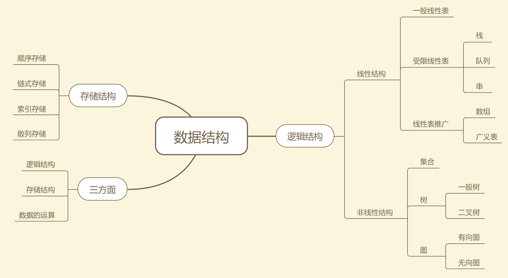

# 算法学习记录

## 源代码目录

**algorithm(源代码)**

- arr 数组
- backtrack 回溯
- common 
- dp 动态规划
- graph 图
- linear 链表
- offer 剑指offer
- practice 习题
- search 搜索
- sort 排序
- str 字符串
- tool 工具
- tree 二叉树
- IODemo.java 输入输出样例
- Traverse.java 遍历框架

**notes(笔记)**

- 数据结构
- 常见算法
- 二叉树
- 动态规划
- DP游戏
- 回溯
- 排序
- BFS
- 二分搜索
- 滑动窗口


# 数据结构与算法



# 数据结构的基本操作

对于任何数据结构，其基本操作无非**遍历 + 访问**，再具体一点就是：**增删查改**。

数据结构种类很多，但它们存在的目的都是在不同的应用场景，**尽可能高效地增删查改**。

**如何遍历 + 访问？**从最高层来看，各种数据结构的**遍历 + 访问**无非两种形式：

- **线性**，**for/while** 迭代为代表
- **非线性**，**递归**为代表

再具体一步，无非以下几种框架：

- **数组**遍历框架，典型的**线性**迭代结构：

  ```java
  public void traverseArr(int[] arr) {
      for (int i = 0; i < arr.length; i++) {
          // 迭代访问
          System.out.println(i);
      }
  }
  ```

- **链表**遍历框架，兼具**迭代和递归**结构：

  ```java
  // 基本的单链表节点
  public class ListNode {
      int val;
      ListNode next;
  }
  public void traverseLinear1(ListNode head) {
      // 1.迭代访问 p.val
      for (ListNode p = head; p != null; p = p.next) {
          System.out.println(p.val);
      }
  }
  public void traverseLinear2(ListNode head) {
      // 2.递归访问
      if (head == null) {
          return;
      }
      // 前序
      traverseLinear2(head.next);
      // 后序
  }
  ```

- **二叉树**遍历框架，典型的**非线性递归**遍历结构：

  ```java
  // 基本的二叉树节点
  public class TreeNode {
      int val;
      TreeNode left, right;
  }
  public void traverse(TreeNode root) {
      if (root == null) return;
      System.out.println(root.val);
      traverse(root.left);
      traverse(root.right);
  }
  ```

- **二叉树**框架拓展为**N叉树**遍历框架

  ```java
  // 基本的 N 叉树节点
  public class TreeNode {
      int val;
      TreeNode[] children;
  }
  
  void traverse(TreeNode root) {
      for (TreeNode child : root.children)
          traverse(child);
  }
  ```

- **N 叉树**的遍历又可以扩展为**图的遍历**
  - 因为图就是好几 棵 N 叉棵树的结合体。
  - 图是可能出现环的？用个布尔数组 visited 做标记。


**所谓框架，就是套路。不管如何增删查改，这些代码都是永远无法脱离的结构**，可以把这个结构作为大纲，根据具体问题在框架上添加代码。


# 算法刷题指南

1. **先学习数组、链表**这种基本数据结构的常用算法
2. 学会基础算法之后，不要上来就刷回溯算法、动态规划这类笔试常考题，而应该**先刷二叉树**

因为**二叉树是最容易培养框架思维**的，而且**大部分算法技巧**，**本质上都是树的遍历问题。**

只要涉及递归的问题，都是树的问题，可以先刷树的相关题目，试着从框架上看问题，而**不要纠结于细节问题**。

- 纠结细节问题，比如：纠结 i 到底应该加到 n 还是加到 n - 1，这个数组的大小到底应该 是 n 还是 n + 1？
