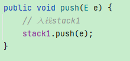
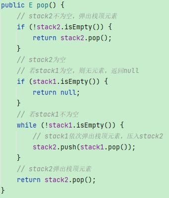

# 两个栈实现队列

## 思路：stack1 作为存储空间，stack2 作为临时缓冲区。

- 入队时：将元素压入 stack1。

- 出队时：**判断 stack2 是否为空**
  - 如**不为空**，则直接弹出顶元素；
  - 如**为空**，则将 **stack1** 的元素**逐个弹出**，并**压入 stack2**，将 **stack2** **栈顶元素弹出**作为**出队**元素。

