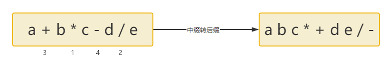
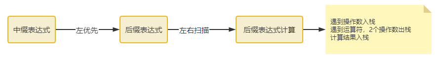

# 中缀表达式计算

- 两个栈：操作数栈1，运算符栈2
- 操作数入栈1，运算符入栈2
- 运算符入栈2时，先进行**运算符优先级比较**，
  - 要入栈运算符 **大于** 栈顶运算符 优先级，入栈
  - 否则**小于或等于**，依次弹出栈2运算符**（后缀计算）**
    - 每次弹出时，栈1弹出两个操作数，进行运算，结果入操作数栈1

# 中缀转后缀（手动模拟）

- 中缀转后缀，遵循左优先原则
- 左优先原则，相同运算符等级，从左边的运算符开始

- 左右扫描，后缀计算，遇到操作数入栈，遇到运算符，2个操作数出栈，计算结果入栈

